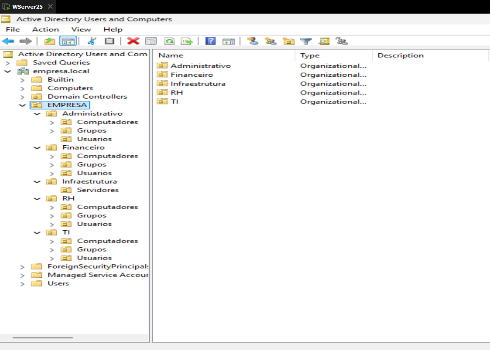
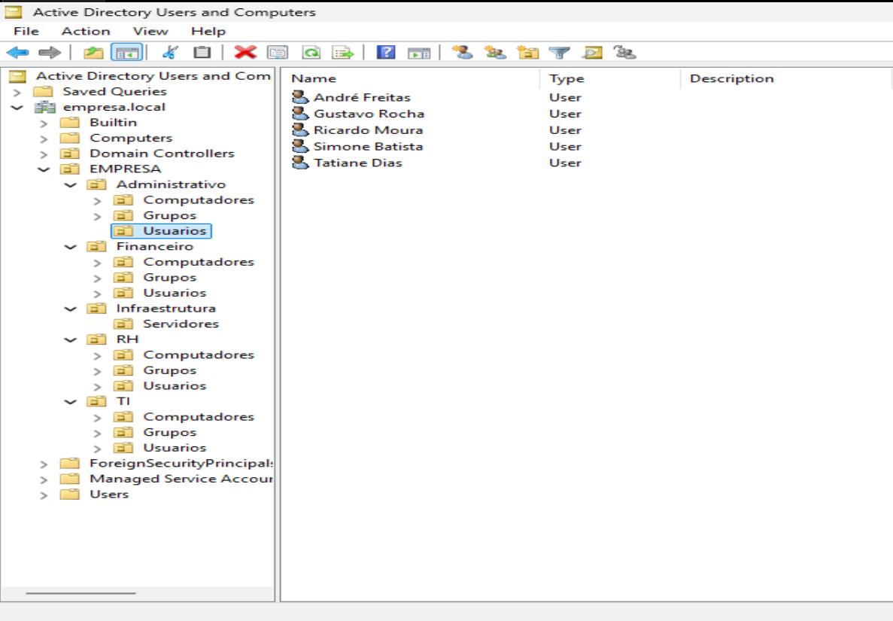
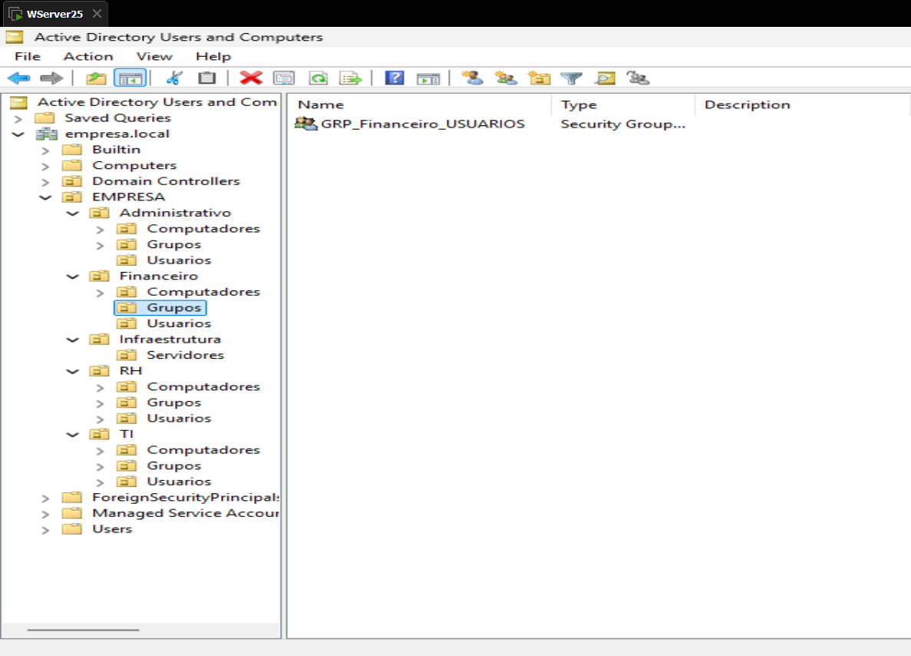

# 🏢 Active Directory Lab - Empresa.local

Projeto prático simulando um ambiente corporativo utilizando Active Directory.

## 🎯 Objetivo

Demonstrar a criação e organização de um domínio empresarial com:

- Estrutura de OUs por departamento
- Provisionamento automatizado de usuários via PowerShell
- Separação lógica para aplicação de políticas (GPO)
- Base para controle de acesso por grupos

---

## 🏗️ Estrutura do Ambiente

Domínio: `empresa.local`

- EMPRESA
  - Administrativo
  - Financeiro
  - RH
  - TI
  - Infraestrutura

Cada departamento contém:
- Usuarios
- Grupos
- Computadores

---

## ⚙️ Automação

Scripts desenvolvidos em PowerShell:

- Criação de OUs
- Criação de grupos
- Importação de usuários via CSV
- Provisionamento automatizado

---

## 📂 Dataset

Arquivo CSV com dados simulando colaboradores:

- Nome
- Sobrenome
- Departamento
- Cargo
- Gestor
- Data de admissão

---

## 📸 Evidências

### Estrutura de OUs

### Usuários criados

### Grupos criados

---

## 🚀 Como executar

1. Executar script de criação de OUs
2. Criar grupos
3. Importar CSV
4. Executar script de usuários

---

## 🧠 Tecnologias

- Windows Server
- Active Directory
- PowerShell

---

## 💡 Próximos passos

- Ingresso de máquinas clientes no domínio
- Aplicação de GPO por departamento
- Controle de acesso a arquivos
