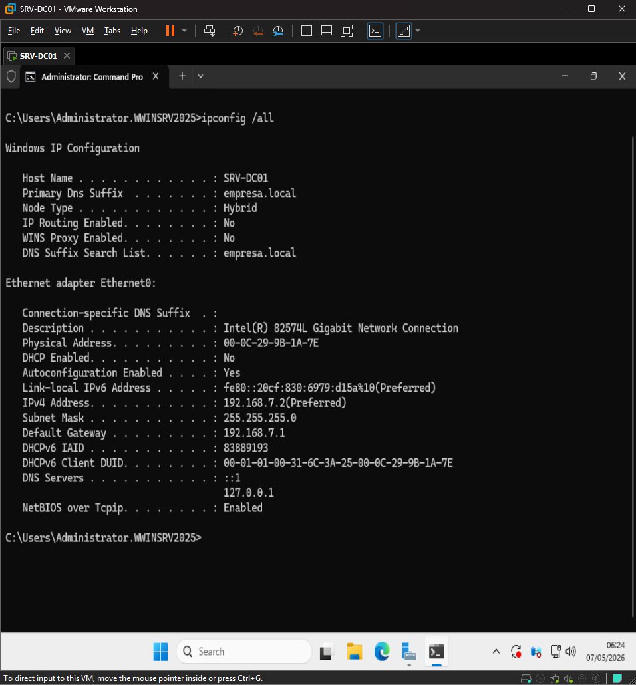
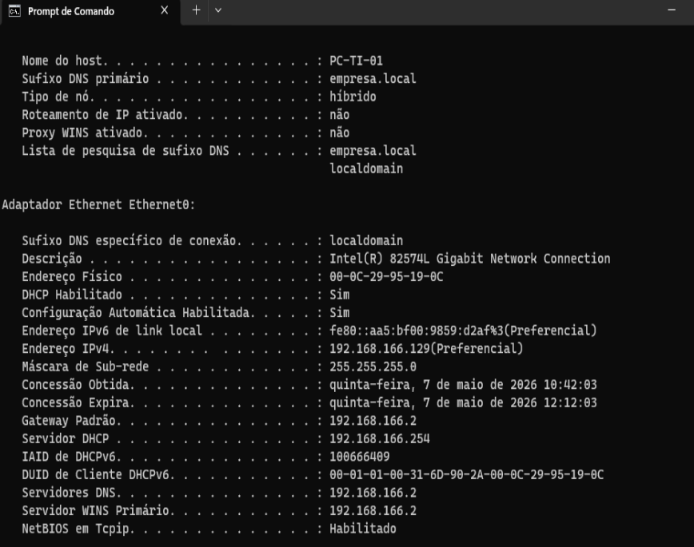
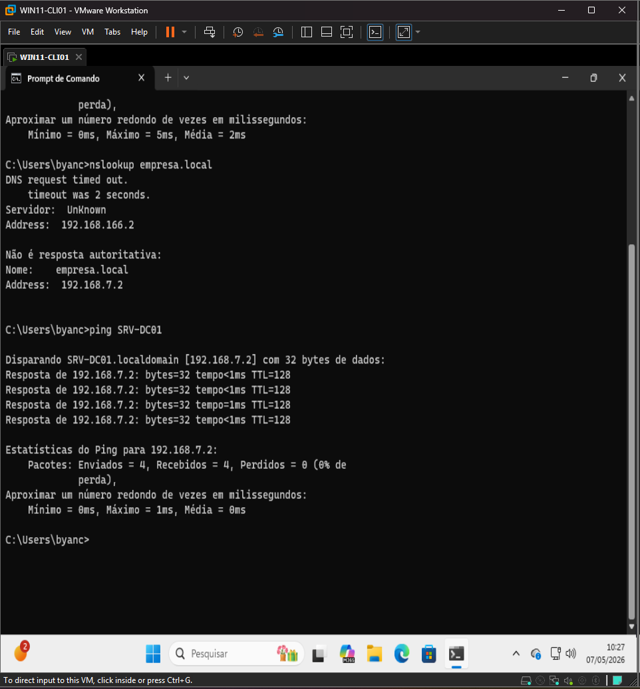
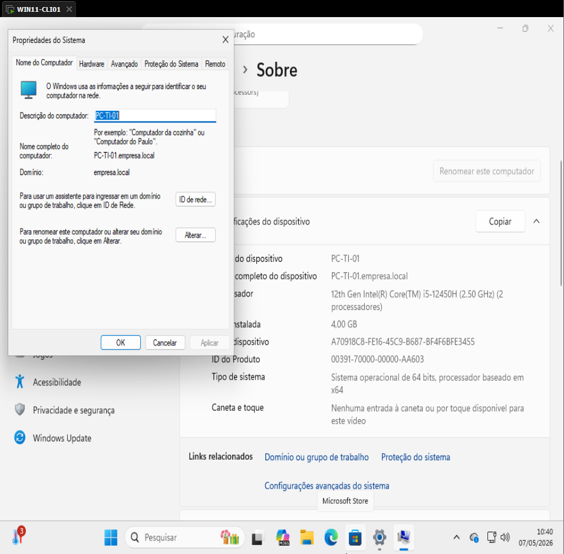
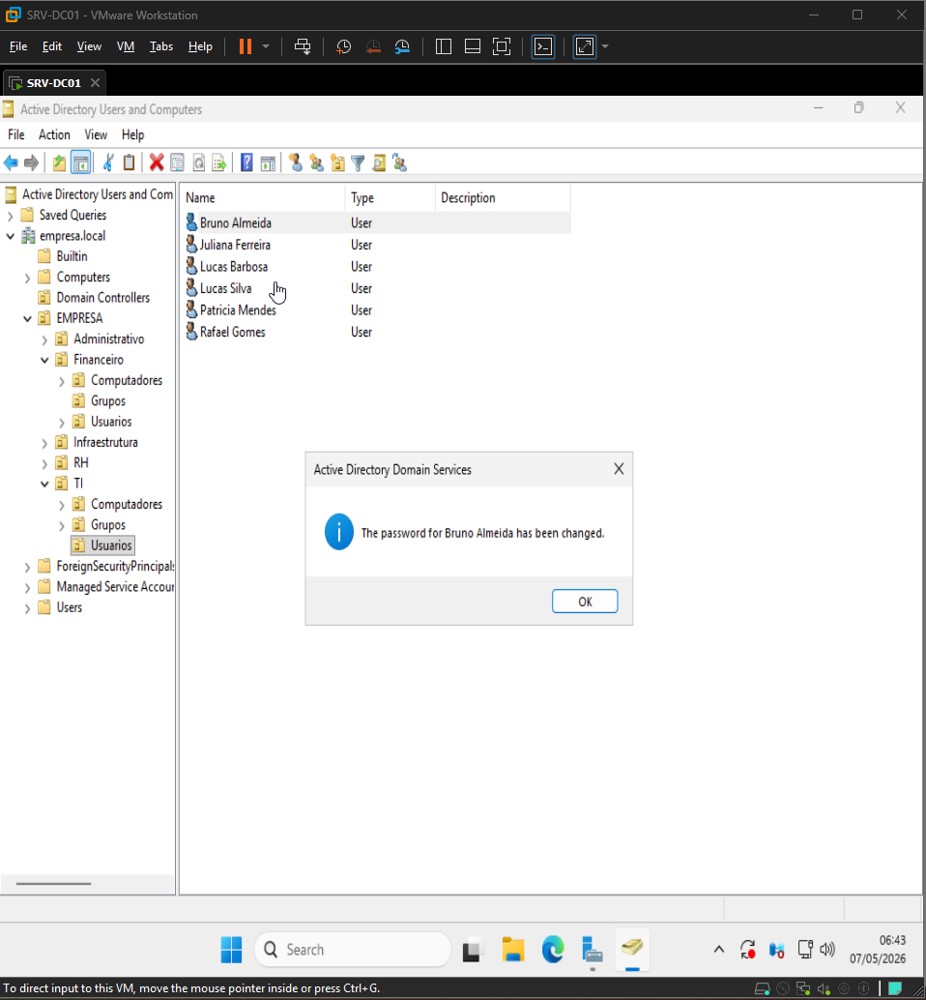
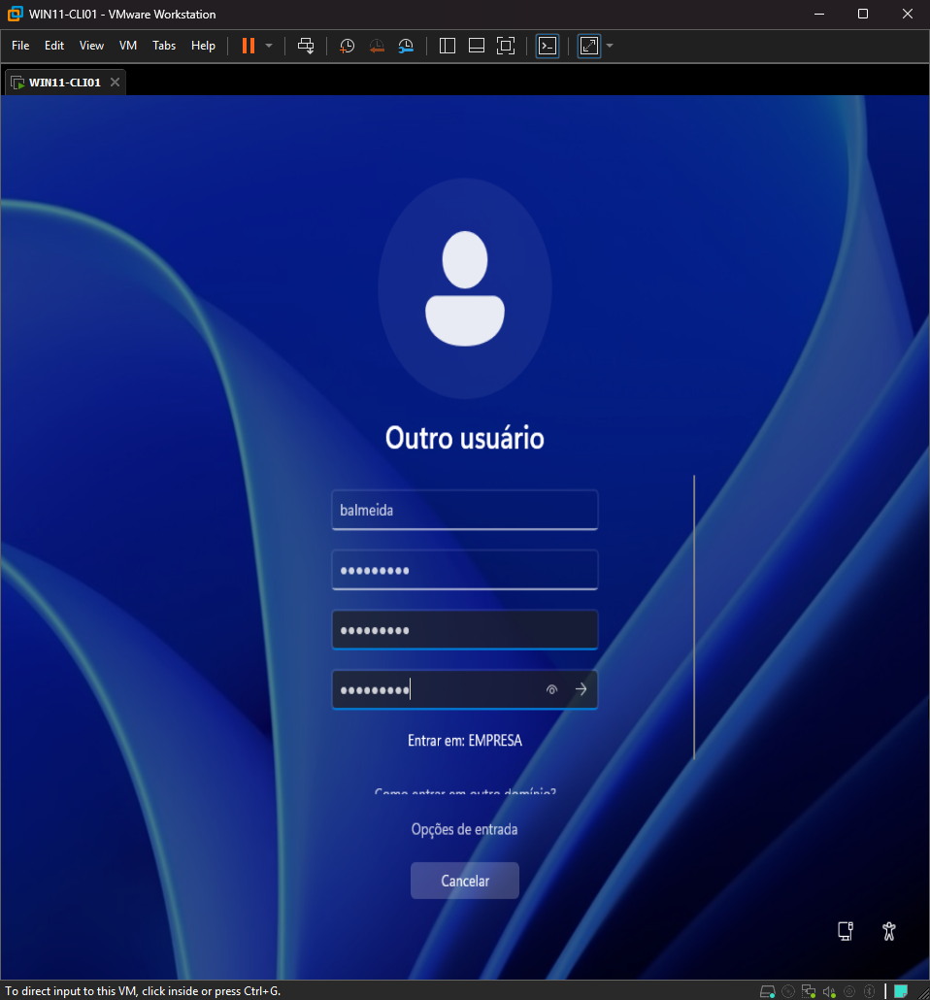
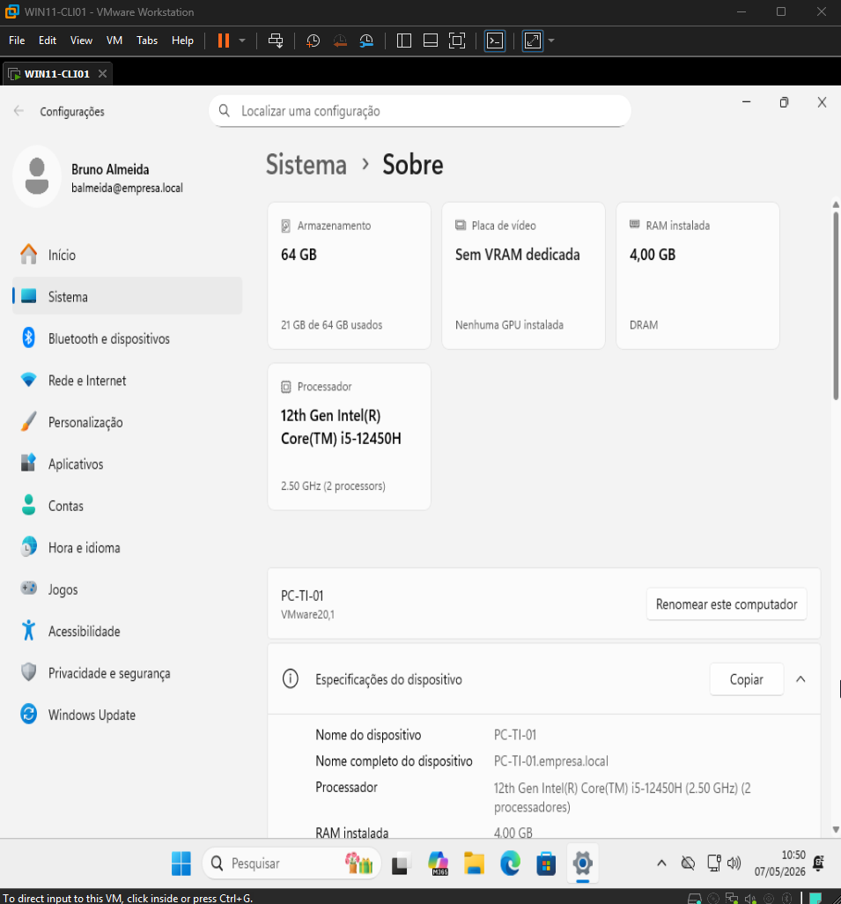
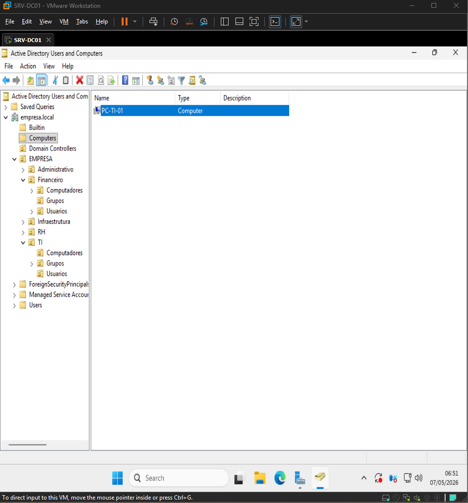
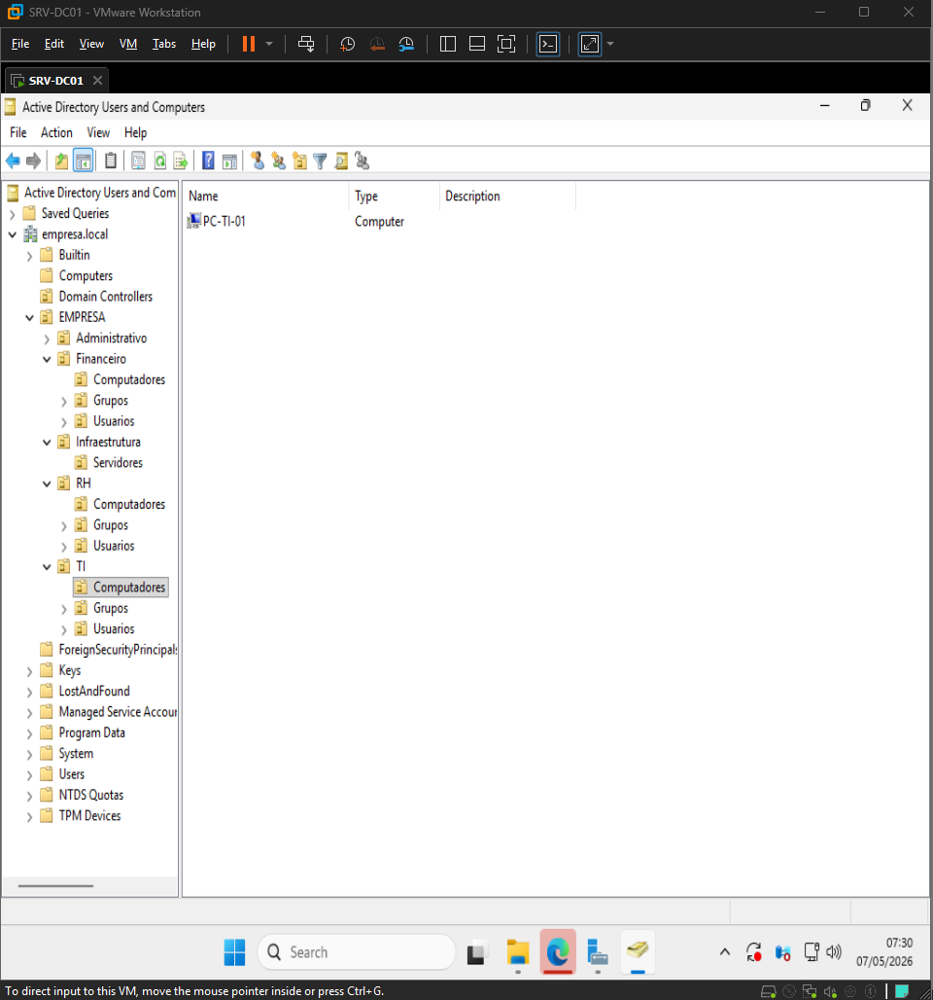
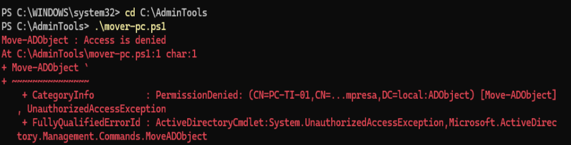

# 🏢 Active Directory Lab - empresa.local

Projeto prático simulando um ambiente corporativo utilizando Active Directory com foco em organização, automação e gerenciamento centralizado de usuários e computadores.

---

## 🎯 Objetivo

Demonstrar a implementação de um domínio corporativo contendo:

* Estrutura organizacional baseada em OUs
* Provisionamento automatizado de usuários via PowerShell
* Separação lógica para aplicação de políticas (GPO)
* Organização de endpoints no domínio
* Controle de acesso baseado em grupos
* Base para gerenciamento corporativo de ambientes Windows

---

## 🏗️ Estrutura do Ambiente

**Domínio:** `empresa.local`

```text
EMPRESA
│
├── Administrativo
│   ├── Usuarios
│   ├── Grupos
│   └── Computadores
│
├── Financeiro
│   ├── Usuarios
│   ├── Grupos
│   └── Computadores
│
├── RH
│   ├── Usuarios
│   ├── Grupos
│   └── Computadores
│
├── TI
│   ├── Usuarios
│   ├── Grupos
│   └── Computadores
│       └── PC-TI-01
│
└── Infraestrutura
    ├── Usuarios
    ├── Grupos
    └── Computadores
```

---

## 🖥️ Gerenciamento de Endpoints

* Ingresso de máquinas Windows no domínio
* Organização de computadores por OU
* Estrutura preparada para aplicação de GPO

---

## ⚙️ Automação

Scripts desenvolvidos em PowerShell para automação de tarefas administrativas:

* Provisionamento automatizado de OUs
* Criação de grupos organizacionais
* Importação de usuários via CSV
* Provisionamento automatizado de usuários
* Organização de computadores no domínio

---

## 📂 Dataset

Arquivo CSV contendo dados simulados de colaboradores:

* Nome
* Sobrenome
* Departamento
* Cargo
* Gestor
* Data de admissão

---

## 📸 Evidências

### Estrutura de OUs


### Usuários criados


### Grupos organizacionais


### Resolução DNS do domínio





### Inclusão de máquina em domínio



### Reset de senha e login em máquina com usuário





### Organização de endpoints




---

## 🛠️ Troubleshooting

Durante o processo foi identificado bloqueio por proteção contra exclusão acidental no objeto do Active Directory.



A correção foi realizada através da remoção da opção:

Protect object from accidental deletion

---

## 🚀 Como executar

### 1. Criar estrutura organizacional

```powershell
.\01-criar-ous.ps1
```

### 2. Criar grupos

```powershell
.\02-criar-grupos.ps1
```

### 3. Importar usuários

```powershell
.\03-criar-usuarios.ps1
```

### 4. Importar demais usuários

```powershell
.\04-criar-usuarios2.ps1
```

### 5. Organizar computadores no domínio

```powershell
.\05-mover-computadores.ps1
```
---

## 🧠 Tecnologias

* Windows Server
* Active Directory
* PowerShell
* DNS

---

## 💡 Próximos passos

* Aplicação de GPO por departamento
* Controle de acesso NTFS

---

## 👨‍💻 Autor

Projeto desenvolvido para fins de estudo, prática de administração Windows e portfólio profissional.
